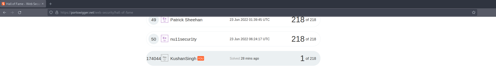

# CodePath 2022

# Cybersecurity Pre-work: Brute force attacks
This task involved enumerating usernames and passwords on [The Blog](https://portswigger.net/users?returnurl=%2facademy%2flabs%2flaunch%2fbb33e208e844c60faa4fe5876260053b536745d65312212a398ef5799fad29c8%3freferrer%3d%252fweb-security%252fauthentication%252fpassword-based%252flab-username-enumeration-via-different-responses) lab by [PortSwigger WebSecurity Academy](https://portswigger.net/web-security).
